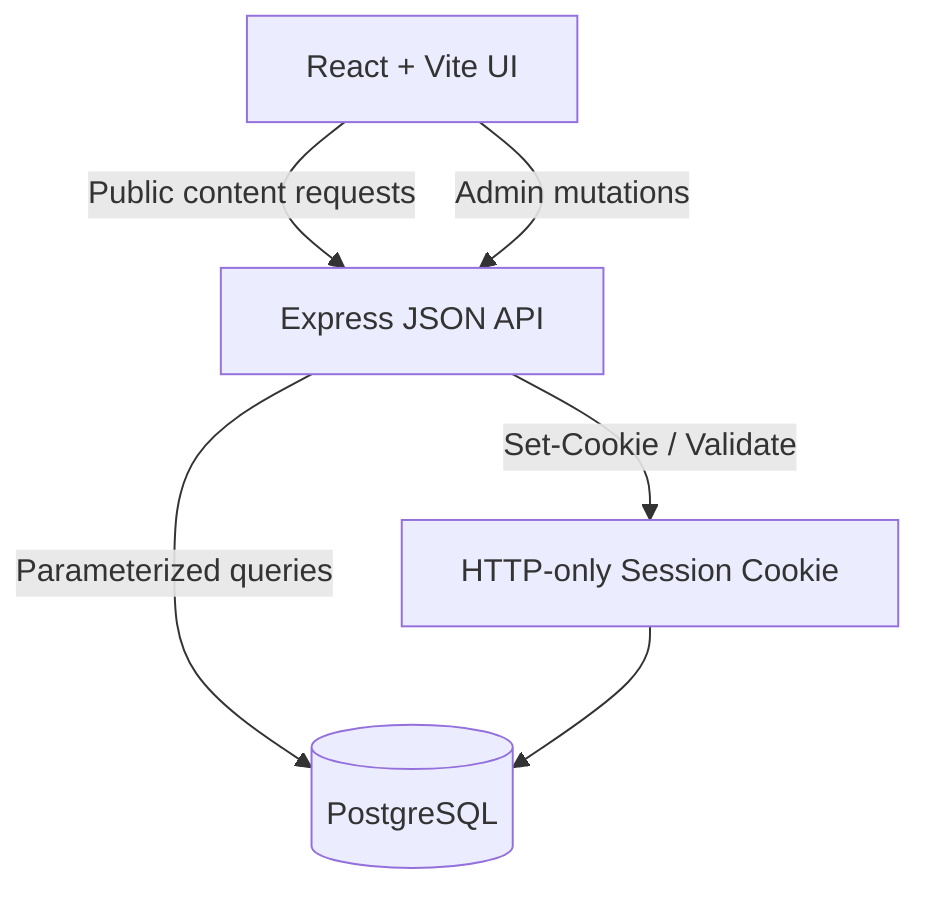
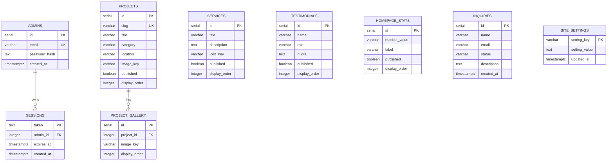

# StudioCraft Engineering Notes

This directory contains the technical notes that sit behind the StudioCraft portfolio application. The root [`README.md`](../README.md) introduces the product and explains how to run it. This document focuses on the decisions a developer needs when adding a feature, changing the data model, or deploying the application.

## Documentation map

| Topic | Location |
|---|---|
| Product overview and setup | [`../README.md`](../README.md) |
| API implementation | [`../server/index.ts`](../server/index.ts) |
| PostgreSQL schema | [`../server/schema.sql`](../server/schema.sql) |
| Seed data and local initialization | [`../server/seed.ts`](../server/seed.ts) |
| Database connection | [`../server/db.ts`](../server/db.ts) |
| Session and password handling | [`../server/auth.ts`](../server/auth.ts) |
| Shared client API types | [`../src/lib/api.ts`](../src/lib/api.ts) |
| Admin interface | [`../src/pages/AdminPage.tsx`](../src/pages/AdminPage.tsx) |
| Public content pages | [`../src/pages/`](../src/pages/) |

## How the application is split

The project is intentionally divided into three small layers:

- **React client:** renders the public site and admin interface, handles navigation, and calls the API through the shared client helper.
- **Express server:** exposes public content routes, protects admin routes, validates sessions, and serves the production frontend bundle.
- **PostgreSQL:** stores editable content, inquiries, administrator records, and sessions.



The client does not connect directly to PostgreSQL. This keeps credentials on the server and gives the API one place to enforce publishing rules and admin authorization.

## Content model

The public site is driven by five editable areas:

| Collection | Used by | Main controls |
|---|---|---|
| Projects | Homepage, portfolio, project detail | Slug, category, metadata, gallery, publish state, order |
| Services | Homepage and services page | Title, description, icon, publish state, order |
| Testimonials | Homepage | Name, role, quote, publish state, order |
| Homepage stats | Homepage metrics row | Value, label, publish state, order |
| Site settings | Footer and contact page | Studio name, email, phone, address |

Inquiries are stored separately because they are operational records rather than public content. They are visible only to authenticated administrators.

## Database relationship view



### Data rules

Published content is the only content returned by public collection endpoints. `display_order` is the presentation order and should be treated as a stable editorial field. Project slugs are unique because they are part of the public URL. Gallery rows are removed and recreated when a project gallery is updated, which keeps the editing path predictable for this small CMS.

## API conventions

The API is JSON-first and uses conventional HTTP methods:

| Operation | Method | Expected result |
|---|---|---|
| Read a public collection | `GET` | Published rows ordered for presentation |
| Create an admin record | `POST` | `201` with the created record |
| Edit an admin record | `PATCH` | `200` with the updated record |
| Delete an admin record | `DELETE` | `204` or a success response |
| Invalid admin session | Any protected route | `401` |
| Missing or invalid input | Any write route | `400` |

The public contact form posts camelCase fields from the React form. The server normalizes them into the database columns used by `inquiries`.

## Authentication model

The admin login flow is deliberately small:

1. The server looks up the administrator by email.
2. The submitted password is checked against the stored salted `scrypt` hash.
3. A cryptographically random session token is written to `sessions`.
4. The token is returned in an HTTP-only cookie.
5. Protected routes load the session and reject expired or missing tokens.
6. Logout deletes the server-side session and clears the cookie.

For production, use HTTPS, a strong unique administrator password, a private database network, and a deployment-specific secret policy. Never place a real password in `.env.example` or in a commit.

## Adding a new editable collection

When adding another CMS-managed collection, follow the existing pattern instead of putting content directly into a page component:

1. Add the table and indexes to `server/schema.sql`.
2. Add idempotent seed records to `server/seed.ts`.
3. Add public published-only and authenticated admin routes to `server/index.ts`.
4. Add the shared type and API call shape to `src/lib/api.ts`.
5. Add the collection state, form, list, and CRUD handlers to `AdminPage.tsx`.
6. Replace hard-coded public content with API data and retain a sensible fallback where appropriate.
7. Add a focused test or validation case and update the root README if the public API changes.

## Local development checklist

```bash
npm install
docker compose up -d
npm run db:setup
npm run server
npm run dev
```

The Vite client runs on port `8080` and forwards `/api` requests to the Express server on port `3000`. If the database is unavailable, public pages that support fallback content remain readable, but admin operations and inquiry persistence require PostgreSQL.

## Release checklist

Before creating a release or deploying a production build, confirm the following:

- `DATABASE_URL` points to the intended PostgreSQL instance.
- `ADMIN_PASSWORD` is set outside the repository and is not reused elsewhere.
- `NODE_ENV=production` is configured for production cookies.
- The schema has been applied and the initial admin account exists.
- `npm run typecheck`, `npm run typecheck:server`, `npm run lint`, `npm test`, and `npm run build` complete successfully.
- No `.env`, local browser profile, build output, or temporary capture log is tracked.
- Public screenshots and documentation refer to the current UI rather than an earlier build.

## Practical maintenance notes

The image registry in `src/lib/projectImages.ts` is intentionally explicit. When an administrator selects an image key, it must exist in that registry or the UI will fall back to the default project image. If a new image is added, register it there and update the relevant seed data together.

The application is small enough that a full service layer would add more ceremony than value at this stage. Route handlers use the shared PostgreSQL pool directly, which keeps the code easy to follow. If the number of resources or business rules grows substantially, extract validation and resource-specific data access into separate modules rather than making `server/index.ts` larger.

## Author

Maintained by [Nazmus Sakib](https://nazmussakib.tech/).

- [Portfolio](https://nazmussakib.tech/)
- [LinkedIn](https://www.linkedin.com/in/nazmussakib247/)
- [GitHub](https://github.com/Nazmussakib247)
